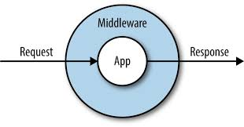
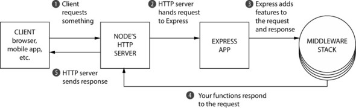

# warmup-week11day02-middleware

## Middleware and the Middleware Stack
### Middleware
Middleware are functions that execute during the lifecycle of a request to the Express server. Each middleware has access to the HTTP request and response for each route it's attached to.



#### Why middleware?
Middleware allows you to break these request handler functions into smaller bits. These smaller functions tend to handle one thing at a time.


### Middleware Stack
Middleware stack is a stack of middleware functions



### Types of middleware in express
- Application-level middleware
- Router-level middleware
- Error-handling middleware
- Built-in middleware
- Third-party middleware

#### Application-level middleware
Bind application-level middleware to an instance of the app object by using the app.use() and app.METHOD() functions, where METHOD is the HTTP method of the request that the middleware function handles (such as GET, PUT, or POST) in lowercase.

```js
app.use(function (req, res) {
  console.log('Time:', Date.now())
})
```

#### Router-level middleware
Router-level middleware works in the same way as application-level middleware, except it is bound to an instance of express.Router().
Load router-level middleware by using the router.use() and router.METHOD() functions.
```js
const router = express.Router()
router.use(function (req, res, next) {
  console.log('Time:', Date.now())
  next()
})
```


.........etc.